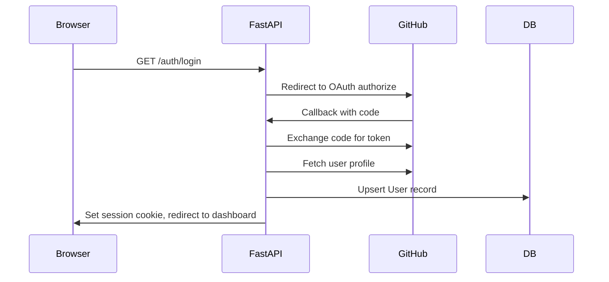
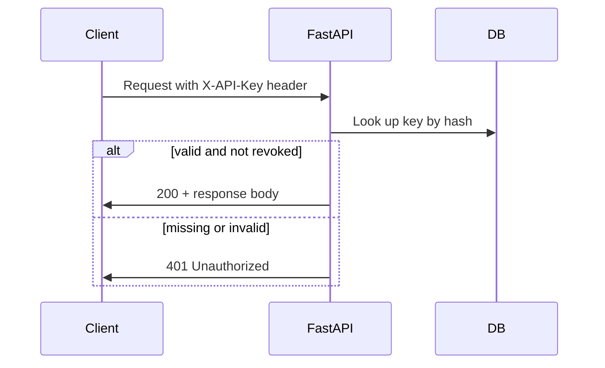

# Fictionary Architecture

## Stack

| Layer | Choice | Notes |
|-------|--------|-------|
| API framework | FastAPI | Auto-generated OpenAPI docs, async support, Python typing |
| ORM | SQLModel | Pydantic + SQLAlchemy; shared models for DB and API schemas |
| Database (production) | Neon PostgreSQL | Serverless Postgres; connection string via environment variable |
| Database (local) | PostgreSQL 16 via Docker Compose | Mirrors production schema without external dependencies |
| Web UI | Jinja2 templates | Server-rendered admin panel and student dashboard inside FastAPI |
| Web auth | GitHub OAuth | SSO for browser sessions; no password management |
| API auth (v2) | API keys | Hashed keys stored in DB; sent via `X-API-Key` header |
| Hosting | Vercel | Python serverless functions for the FastAPI app |
| Local dev | Docker Compose | App container + Postgres container |

## Project Structure

```
fictionary/
├── app/
│   ├── main.py              # FastAPI app factory, router mounting, lifespan
│   ├── config.py            # Settings from environment variables
│   ├── database.py          # Engine, session dependency, table creation
│   ├── models/              # SQLModel table definitions
│   │   ├── user.py
│   │   ├── api_key.py
│   │   ├── media_item.py
│   │   ├── creator.py
│   │   ├── franchise.py
│   │   ├── medium.py
│   │   └── genre.py
│   ├── routers/
│   │   ├── api_v1/          # Unauthenticated media-item CRUD
│   │   └── api_v2/          # Authenticated full API
│   ├── web/
│   │   ├── auth.py          # GitHub OAuth routes and session handling
│   │   ├── student.py       # Student dashboard routes
│   │   └── admin.py         # Admin panel routes
│   ├── dependencies.py      # Shared deps (get_db, get_current_user, require_api_key)
│   └── templates/           # Jinja2 HTML templates
│       ├── base.html
│       ├── student/
│       └── admin/
├── alembic/                 # Database migrations
├── docker-compose.yml
├── Dockerfile
├── pyproject.toml
└── vercel.json
```

## API Organization

Two versioned routers mounted under a common prefix:

```
/api/v1/...   → no auth required
/api/v2/...   → requires X-API-Key header
```

### v1 router (`/api/v1`)

- `GET    /media-items`
- `GET    /media-items/{id}`
- `POST   /media-items`
- `PUT    /media-items/{id}`
- `DELETE /media-items/{id}`

Operates on flat `MediaItem` records only. No nested or related resources.

### v2 router (`/api/v2`)

All v1 media-item endpoints, plus:

- CRUD for `creators`, `franchises`, `media`, `genres`
- Relationship endpoints on media items, e.g.:
  - `POST   /media-items/{id}/creators` — link a creator
  - `DELETE /media-items/{id}/creators/{creator_id}` — unlink
  - `POST   /media-items/{id}/genres` — add a genre tag
  - `PUT    /media-items/{id}` — update including `franchise_id` and `medium_id`

## Data Model

### User

- `id`, `github_id`, `username`, `display_name`, `is_admin`, `created_at`
- Created on first GitHub OAuth sign-in
- `is_admin` is set manually (seed script or direct DB flag) — not self-service

### ApiKey

- `id`, `user_id`, `key_hash`, `prefix` (first 8 chars for display), `created_at`, `revoked_at`
- One active key per user at a time; regenerating revokes the previous key
- Plaintext key shown once at creation/regeneration in the student dashboard

### MediaItem

- `id`, `title`, `description`, `release_year`
- `franchise_id` (FK, nullable), `medium_id` (FK, required in v2)
- Association tables: `media_item_creators`, `media_item_genres`

### Creator

- `id`, `name`, `bio` (optional)

### Franchise

- `id`, `name`, `description` (optional)

### Medium

- `id`, `name` — e.g., "novel", "film", "TV series", "video game"

### Genre

- `id`, `name` — e.g., "fantasy", "science fiction"

## Authentication Flows

### Web session (dashboard + admin panel)



- Signed cookie-based session (starlette `SessionMiddleware`)
- Admin routes check `user.is_admin` and return 403 otherwise

### API key (v2 programmatic access)



- Keys generated with `secrets.token_urlsafe(32)`
- Only the SHA-256 hash is stored; plaintext shown once in the dashboard

## Deployment

### Local development

```bash
docker compose up
```

Docker Compose runs:

- **app** — FastAPI with hot reload, port 8000
- **db** — PostgreSQL 16, port 5432

Environment variables loaded from `.env` (see `.env.example`). Local Postgres replaces Neon; no external services required.

### Production (Vercel + Neon)

- FastAPI app deployed as Vercel Python serverless functions (`vercel.json` routes all requests to the app)
- `DATABASE_URL` points to the Neon connection string
- `GITHUB_CLIENT_ID`, `GITHUB_CLIENT_SECRET`, `SESSION_SECRET` set in Vercel environment
- Use async database driver (`asyncpg` or SQLAlchemy async engine) to avoid connection exhaustion in serverless

### Database migrations

- Alembic for schema changes
- Migrations run as a deploy step or manual command against Neon
- Local: `alembic upgrade head` inside the app container

## Environment Variables

| Variable | Required | Description |
|----------|----------|-------------|
| `DATABASE_URL` | yes | PostgreSQL connection string |
| `GITHUB_CLIENT_ID` | yes | GitHub OAuth app client ID |
| `GITHUB_CLIENT_SECRET` | yes | GitHub OAuth app client secret |
| `SESSION_SECRET` | yes | Secret for signing session cookies |
| `APP_URL` | prod | Public base URL for OAuth callback (e.g., `https://fictionary.vercel.app`) |

## Key Design Constraints

- **Serverless-compatible DB access** — use connection pooling appropriate for Vercel (Neon serverless driver or short-lived connections); avoid assuming a persistent process
- **v1 stays open** — no middleware auth on the v1 router; auth dependency applied only to v2 routes
- **Admin is UI-only** — admin CRUD happens through Jinja2 templates, not a separate admin API
- **Single repo** — API and web UI live in one FastAPI app; no separate frontend build step
